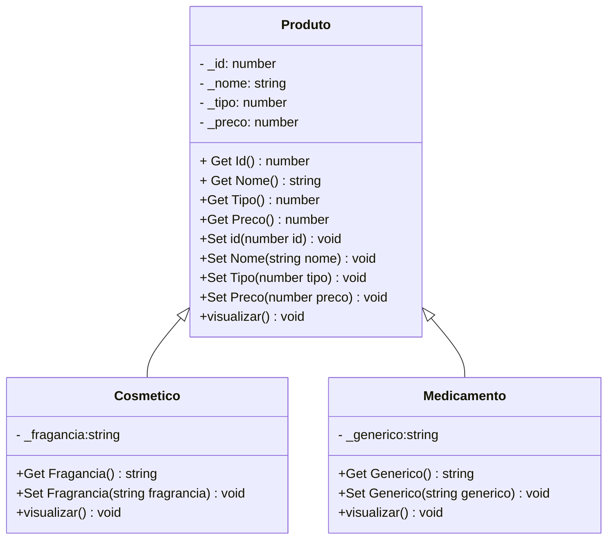

# Sistema de Gerenciamento de Produtos Farmacêuticos 🏥💊

Este projeto é um sistema de gerenciamento de produtos farmacêuticos, que inclui medicamentos e cosméticos. Ele permite a criação, listagem, consulta, atualização e deleção de produtos, e inclui funcionalidades específicas para cada tipo de produto.

##

### Tecnologias Utilizadas ⚙️

- **TypeScript**: Linguagem de programação usada no desenvolvimento do sistema.
- **Node.js**: Ambiente de execução para executar o código TypeScript.

##

### Funcionalidades 🛠️

- **`Criar Produto`** 📝
- **`Listar Todos Produtos`** 📋
- **`Consultar Produto por ID`** 🔍
- **`Atualizar Produto`** ✏️
- **`Deletar Produto`** 🗑️

## Diagrama de Classes



## Como Rodar o Projeto 🚀

1. **Instalar Dependências** 📦

Se você ainda não tiver o Node.js instalado, faça o download e instale-o a partir de [nodejs.org](https://nodejs.org/).

Após instalar o Node.js, clone o repositório e instale as dependências:

```
git clone https://github.com/Samuel-1210/projeto_farmacia.git
```

```
cd projeto_farmacia
```

```
npm install
```

2. **Executar** 🚀

```
ts-node Menu.ts
```
